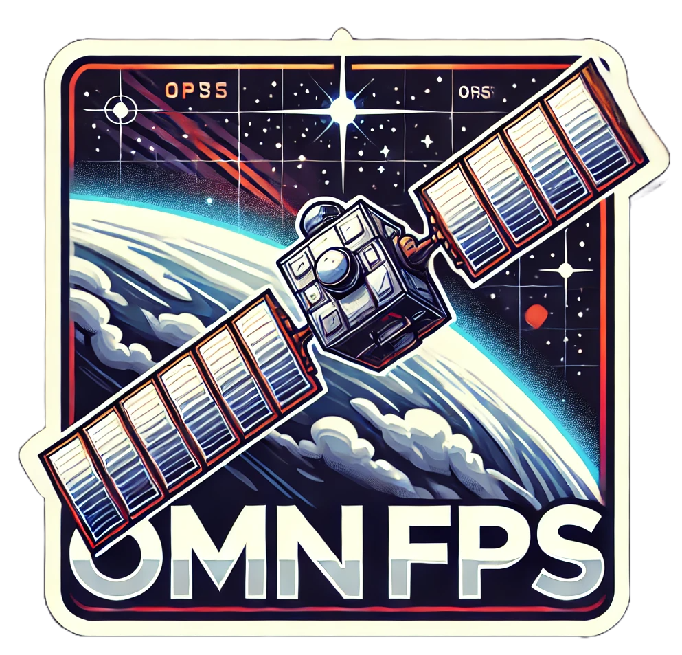

 
Omniverse Floating Platform Simulator

## Setup Instructions
### Obtaining the Isaac Sim Container

> [!IMPORTANT]
> Generate your NGC [key](https://docs.nvidia.com/ngc/gpu-cloud/ngc-user-guide/index.html#generating-api-key).
> More [info](https://catalog.ngc.nvidia.com/orgs/nvidia/containers/isaac-sim).

```
docker login nvcr.io
Username: $oauthtoken
Password: <Your Key>
docker pull nvcr.io/nvidia/isaac-sim:4.2.0
./docker.zeroGlab/build.sh
```


## Getting Started
```
./docker.zeroGlab/run.sh
/isaac-sim/python.sh run.py
```


On another terminal w/ docker 

```
docker exec -it -w /workspace/control_workstation isaac-sim-zeroGlab-container /bin/bash
./setup_ws.sh
source install/setup.bash
ros2 run unilufp_multibytearr_keyboard unilufp_multibytearr_keyboard
```

On another terminal w/o docker w/ sourced ros2

>[!Note]
> Source the setup files before running the commnads below
> ```
> cd control_workstation
> colcon build
> source install/setup.bash
> ```

**Keyboard control**
```
ros2 run unilufp_multibytearr_keyboard unilufp_multibytearr_keyboard
```

**Random Gausian PoseStamped**
```
ros2 run random_gausian_tf rand_gau_tf_pub
```
